# Инструкция по работе с Git

## 1. Регистрация в GitHub

1. Перейти на https://github.com

2. Нажать Sign Up

3. Ввести email, пароль и имя пользователя

4. Подтвердить почту

## 2. Установка Git

1. Зайти на официальный сайт: https://git-scm.com

2. Скачать установщик под Вашу операционную систему

3. Запустить установщик

4. Во время установки на вопрос о настройке переменной PATH выбрать:
   - **"Git from the command line and also from 3rd-party software"** (чтобы Git работал и в обычном терминале, и в Git Bash)
5. Остальное можно оставить по умолчанию

Проверка установки:

`git --version`

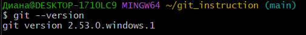

**Первоначальная настройка**

git config --global user.name "Имя"

git config --global user.email "email@example.com"

## 3. Работа с локальным репозиторием

**Работа с коммитами**

`git init` – создать новый репозиторий в текущей папке

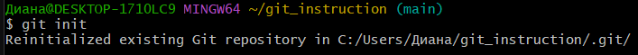

`git status` – проверить состояние файлов

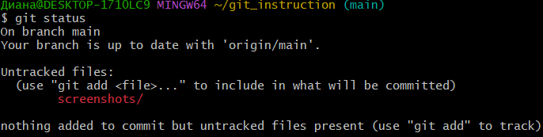

`git add README.md` – добавить один файл для отслеживания

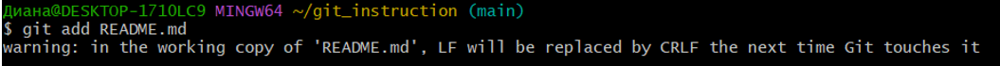

`git add .` – добавить все файлы в папке

`git commit -m "Текст сообщения"` – сделать коммит (сохранить изменения)

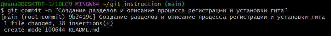

`git log --oneline` – посмотреть историю коммитов

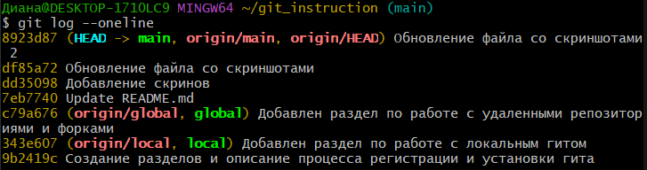

`git log --oneline --graph` - дерево комиитов

`git log --all` - все коммиты во всех ветках

`git log --author=Имя` - коммиты конкретного автора

`git log --oneline --graph --all --decorate` - полное дерево

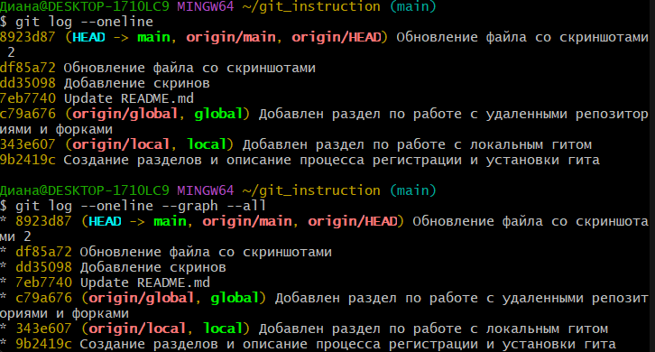

`git diff` – посмотреть разницу между текущим и последним коммитом

**Работа с ветками**

`git branch имя-ветки` – создать новую ветку

`git checkout имя-ветки` – переключиться на другую ветку

`git checkout -b имя-ветки` – создать ветку и сразу переключиться на неё

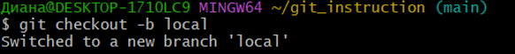

`git branch` – посмотреть все ветки

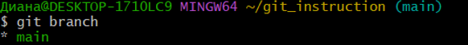

`git branch -d имя-ветки` – удалить ветку (безопасно)

`git branch -D имя-ветки` – удалить ветку (принудительно)

`git checkout main` – переключиться на ветку main

`git merge local` – влить ветку local в текущую ветку

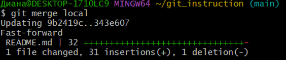

**Разрешение конфликтов**

Конфликт возникает при слиянии двух веток, где один и тот же файл изменен по-разному в одних и тех же строках

**Как решить конфликт**

1. Открыть файл

2. Удалить маркеры

3. Оставить нужный текст

4. Сохранить файл

## 4. Работа с удалённым репозиторием

`git remote add origin https://github.com/логин/репозиторий.git` – привязать локальный репозиторий к GitHub

`git remote -v` – посмотреть связанные удалённые репозитории

`git push -u origin main` – отправить изменения на GitHub (первый раз)

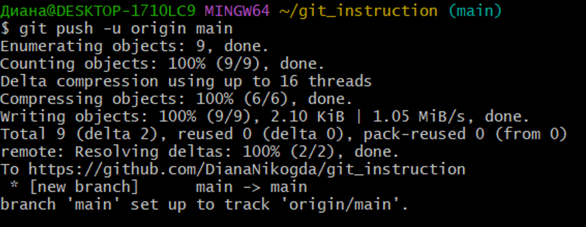

`git push origin main` – отправить изменения на GitHub (последующие разы)

`git pull origin main` – загрузить изменения с GitHub

`git fetch origin` – скачать изменения с GitHub без автоматического слияния

`git clone https://github.com/логин/репозиторий.git` – клонировать чужой репозиторий к себе на компьютер

## 5. Работа с форками

**Форки** – это копия чужого репозитория на вашем аккаунте GitHub.

**Работа с форком:**

1. На странице чужого репозитория нажать кнопку **Fork**

2. Клонировать свой форк: `git clone https://github.com/логин/форк.git`

3. Добавить оригинальный репозиторий: `git remote add upstream https://github.com/владелец/оригинал.git`

4. Создать ветку: `git checkout -b текст`

5. Добавить изменения, затем: `git add .` и `git commit -m "описание"`

6. Отправить в свой форк: `git push origin текст`

7. На GitHub открыть **Pull Request**

**Синхронизация форка с оригиналом:**

`git checkout main`

`git fetch upstream`

`git merge upstream/main`

`git push origin main`

